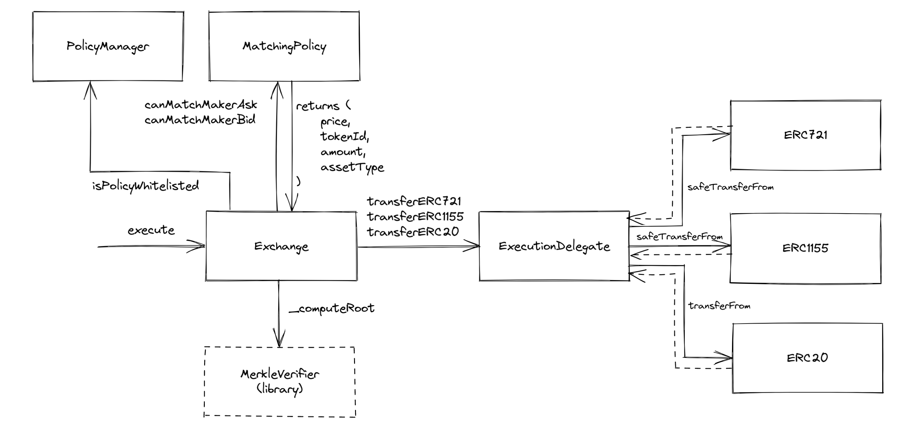

# blur-analysis

## Blur.io: Marketplace

BlurSwap

clone 自 gem。

处理聚合操作的合约。

https://etherscan.io/address/0x39da41747a83aee658334415666f3ef92dd0d541

## Blur.io: Marketplace 2

BlurExchange

https://etherscan.io/address/0x000000000000ad05ccc4f10045630fb830b95127




### (1) BlurExchange

主合约，负责交易的执行。

订单的定义

```solidity
struct Order {
    address trader; // 订单创建者
    Side side; // 交易方向
    address matchingPolicy; // 交易策略
    address collection;
    uint256 tokenId;
    uint256 amount;
    address paymentToken;
    uint256 price;
    uint256 listingTime;
    /* Order expiration timestamp - 0 for oracle cancellations. */
    uint256 expirationTime;
    Fee[] fees;
    uint256 salt;
    bytes extraParams;
}

enum Side { Buy, Sell }
enum SignatureVersion { Single, Bulk }

```

订单的匹配通过 `execute()` 进行匹配。

```solidity
struct Input {
    Order order;
    uint8 v;
    bytes32 r;
    bytes32 s;
    bytes extraSignature;
    SignatureVersion signatureVersion;
    uint256 blockNumber;
}
```

```solidity
function execute(Input calldata sell, Input calldata buy)
        external
        payable
        reentrancyGuard
        whenOpen
    {
        require(sell.order.side == Side.Sell);

        // 计算订单 hash
        bytes32 sellHash = _hashOrder(sell.order, nonces[sell.order.trader]);
        bytes32 buyHash = _hashOrder(buy.order, nonces[buy.order.trader]);

        // 校验订单参数
        require(_validateOrderParameters(sell.order, sellHash), "Sell has invalid parameters");
        require(_validateOrderParameters(buy.order, buyHash), "Buy has invalid parameters");

        // 校验签名，order.trader == msg.sender 则不去校验直接返回 true
        require(_validateSignatures(sell, sellHash), "Sell failed authorization");
        require(_validateSignatures(buy, buyHash), "Buy failed authorization");

        // 校验买卖订单是否能匹配
        (uint256 price, uint256 tokenId, uint256 amount, AssetType assetType) = _canMatchOrders(sell.order, buy.order);

        // 执行资产转移
        _executeFundsTransfer(
            sell.order.trader,
            buy.order.trader,
            sell.order.paymentToken,
            sell.order.fees,
            price
        );

        // 执行 NFT 转移
        _executeTokenTransfer(
            sell.order.collection,
            sell.order.trader,
            buy.order.trader,
            tokenId,
            amount,
            assetType
        );

        /* Mark orders as filled. */
        // 存储订单状态
        cancelledOrFilled[sellHash] = true;
        cancelledOrFilled[buyHash] = true;

        // 发出事件
        emit OrdersMatched(
            sell.order.listingTime <= buy.order.listingTime ? sell.order.trader : buy.order.trader, // 买单时间大，表明此次是由买家触发，事件中的 maker 是买家。相反的 maker 是卖家表明是有卖家触发的订单。
            sell.order.listingTime > buy.order.listingTime ? sell.order.trader : buy.order.trader,
            sell.order,
            sellHash,
            buy.order,
            buyHash
        );
    }
```

订单完成后发出 `OrdersMatched` 事件。

```solidity
    event OrdersMatched(
        address indexed maker,
        address indexed taker,
        Order sell,
        bytes32 sellHash,
        Order buy,
        bytes32 buyHash
    );
```

### (2) MatchingPolicy

在上面撮合订单的方法中会进行校验买卖单能否成交。

```solidity
function _canMatchOrders(Order calldata sell, Order calldata buy)
        internal
        view
        returns (uint256 price, uint256 tokenId, uint256 amount, AssetType assetType)
    {
        bool canMatch;
        if (sell.listingTime <= buy.listingTime) {
            /* Seller is maker. */
            // 校验订单的成交策略是否在白名单中
            require(policyManager.isPolicyWhitelisted(sell.matchingPolicy), "Policy is not whitelisted");
            // 调用具体的校验方法进行校验
            (canMatch, price, tokenId, amount, assetType) = IMatchingPolicy(sell.matchingPolicy).canMatchMakerAsk(sell, buy);
        } else {
            /* Buyer is maker. */
            require(policyManager.isPolicyWhitelisted(buy.matchingPolicy), "Policy is not whitelisted");
            (canMatch, price, tokenId, amount, assetType) = IMatchingPolicy(buy.matchingPolicy).canMatchMakerBid(buy, sell);
        }
        require(canMatch, "Orders cannot be matched");

        return (price, tokenId, amount, assetType);
    }
```

#### PolicyManager

https://etherscan.io/address/0x3a35A3102b5c6bD1e4d3237248Be071EF53C8331

用于管理所有的交易策略。

包括交易策略的添加，移除和查看等功能。

#### MatchingPolicy

目前官方代码里有两类限价单的策略，但是 ERC1155 策略的合约还没有设置进白名单中。

1. StandardPolicyERC721：https://etherscan.io/address/0x00000000006411739DA1c40B106F8511de5D1FAC#code
2. StandardPolicyERC1155

```solidity
function canMatchMakerAsk(Order calldata makerAsk, Order calldata takerBid)
        external
        pure
        override
        returns (
            bool,
            uint256,
            uint256,
            uint256,
            AssetType
        )
    {
        return (
            // 订单方向不能一样
            (makerAsk.side != takerBid.side) && 
            // 支付token相同
            (makerAsk.paymentToken == takerBid.paymentToken) &&
            (makerAsk.collection == takerBid.collection) &&
            (makerAsk.tokenId == takerBid.tokenId) &&
            (makerAsk.matchingPolicy == takerBid.matchingPolicy) &&
            (makerAsk.price == takerBid.price),
            makerAsk.price,
            makerAsk.tokenId,
            1,
            AssetType.ERC721
        );
    }
```

### (3) ExecutionDelegate

买卖双方在授权代币的时候会向 ExecutionDelegate 授权。然后在订单成交的时候由 ExecutionDelegate 负责具体的转移代币的逻辑。

```solidity
// BlurExchange 中的转移方法
// ETH or WETH 的转移
function _transferTo(
        address paymentToken,
        address from,
        address to,
        uint256 amount
    ) internal {
        if (amount == 0) {
            return;
        }

        if (paymentToken == address(0)) {
            /* Transfer funds in ETH. */
            payable(to).transfer(amount);
        } else if (paymentToken == weth) {
            /* Transfer funds in WETH. */
            executionDelegate.transferERC20(weth, from, to, amount);
        } else {
            revert("Invalid payment token");
        }
    }
```

```solidity
// BlurExchange 中的转移方法
// NFT 的转移
function _executeTokenTransfer(
        address collection,
        address from,
        address to,
        uint256 tokenId,
        uint256 amount,
        AssetType assetType
    ) internal {
        /* Assert collection exists. */
        require(_exists(collection), "Collection does not exist");

        /* Call execution delegate. */
        if (assetType == AssetType.ERC721) {
            executionDelegate.transferERC721(collection, from, to, tokenId);
        } else if (assetType == AssetType.ERC1155) {
            executionDelegate.transferERC1155(collection, from, to, tokenId, amount);
        }
    }
```

### (4) Signature Authentication

#### 用户签名

交易所接受由 signatureVersion 参数确定的两种类型的签名认证 - 单一或批量。单个 listing 通过订单哈希的签名进行身份验证。

##### 批量 Listing

要进行批量 listing 的时候，用户需要从订单哈希生成默克尔树并签署树根。最后将订单各自的默克尔路径打包在 extraSignature 中，然后成交的时候再从订单和默克尔路径重构默克尔根，并验证签名。

#### Oracle 签名

此功能允许用户事前明确同意，要求使用最近的区块号对订单进行授权的预言机签名。这启用了一种链下取消方法，预言机可以继续向潜在的接受者提供签名，直到用户请求预言机停止。一段时间后，旧的预言机签名将过期。

要选择事前明确同意，用户必须将 expireTime 设置为 0。为了履行订单，预言机签名必须打包在 extraSignature 中，并且 blockNumber 设置为预言机签名的内容。

